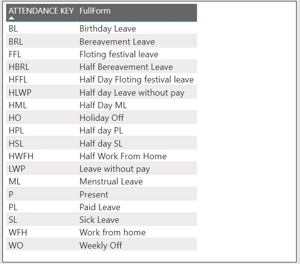
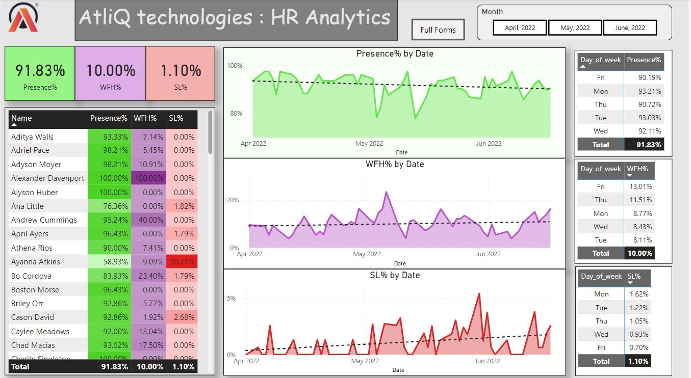

# HR Analytics AtliQ technologies

## Introduction:
Welcome to the HR Analytics Project repository for Atliq Technologies! In this project, we analyzed the attendance data of the last 3 months to provide insights to the HR Generalist. By leveraging data extraction, transformation, and loading techniques, we generated valuable insights using Power BI Desktop.

## Problem Statement

Atliq Technologies' HR Generalist sought insights from the attendance data, collected in key format over the last 3 months. The objective was to gain insights into employee attendance patterns, determine retention strategies, and identify reasons behind sick leave percentages. Additionally, the analysis aimed to differentiate between Work From Home (WFH) and Work From Office (WFO) percentages.

## Data Source: 
The attendance data was provided in the form of an Excel file. The data underwent Extract, Transform, and Load (ETL) operations to prepare it for analysis..

**Steps Followed**

1. **Understanding Problem**:
- Defined the scope of the analysis, focusing on attendance patterns, retention strategies, and sick leave percentages.
2. **Data Gathering and Transformation**:
- Collected the attendance data from the provided Excel file.
- Utilized ETL operations to clean and transform the data into a suitable format for analysis.
3. **Creating Metrics using DAX**:
- Implemented Data Analysis Expressions (DAX) to create key metrics, including attendance percentages, sick leave percentages, WFH 
 percentages, and more.
4. **Dashboarding with Power BI Desktop**:
- Utilized Power BI Desktop to visualize the data and create interactive dashboards.
- Developed visualizations to provide insights into attendance trends, sick leave reasons, WFH vs. WFO percentages, and more.

## Key Abbreviations

## Dashboard Image

## Key Findings: 
Let's delve into these findings to extract meaningful conclusions. 

* Overall Presence: An impressive overall employee presence rate of approximately 91.83% demonstrates a strong commitment to in-office work. This reflects the dedication and professionalism of the workforce at Atliq Technologies.

* Working from Home (WFH): Around 10% of employees prefer the flexibility of working from home. This insight underscores the importance of providing a work-from-home option to promote employee satisfaction and achieve a healthy work-life balance. 

*  Sick Leave (SL) Percentage: The sick leave percentage stands at a commendable 1.10%, indicating a culture of strong attendance and minimal sick leave instances among employees. 

*  Day of the Week and Presence Percentage: Analyzing presence percentages by day of the week reveals interesting patterns: Fridays show a slightly lower presence percentage of 90.19% compared to other weekdays. Mondays witness a high presence percentage of 93.21%, signaling a positive start to the workweek. Saturdays and Sundays have a 0.00% presence percentage, as weekends are non-working days. Thursdays and Wednesdays demonstrate presence percentages of 90.72% and 92.11% respectively, indicating consistent attendance mid-week. Tuesdays mirror Mondays, with a presence percentage of 93.03%. 

## Insights and Recommendations: 
Based on the data analysis, the following insights and recommendations can guide effective decision-making: 

* Office Space Utilization: 
Leverage higher attendance rates on Mondays and Tuesdays to plan team-building exercises and essential meetings that require maximum employee presence. This approach optimizes office space utilization and fosters collaboration. 

* Maintenance and Off-Peak Activities: 
Utilize Fridays and Thursdays, which exhibit slightly lower attendance rates, to focus on office maintenance and organize activities that require fewer employees. This strategy ensures efficient space management without disrupting regular work. 

* Work-from-Home (WFH) Policy: 
Considering the 10% preference for remote work, implementing or strengthening a work-from-home policy can offer employees flexibility and contribute to overall satisfaction and work-life balance. 

* Wellness Programs: 
While the low sick leave percentage indicates good employee health, introducing wellness programs and initiatives can further nurture a healthy work environment, reduce sick leave instances, and promote employee well-being. 

## Conclusion: 
In conclusion, the insightful data analysis empowers Atliq Technologies to optimize office space utilization, foster employee engagement, and enhance work-life balance. By leveraging these findings, the company can make informed decisions regarding team activities, maintenance schedules, work-from-home policies, and wellness programs. These measures will ultimately lead to a more productive and satisfied workforce.
